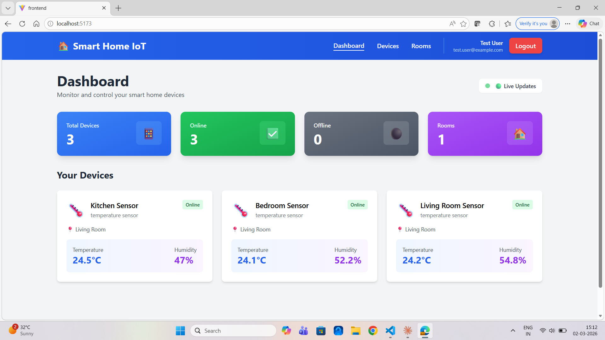
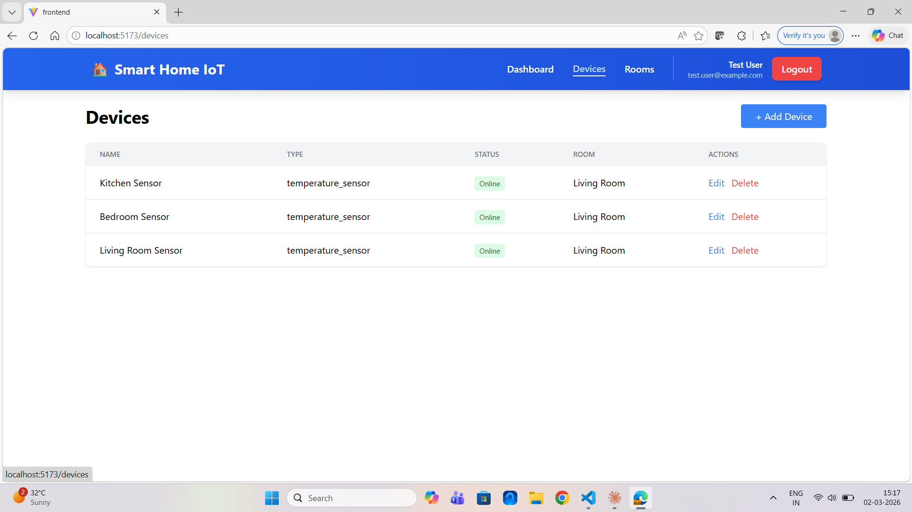

<div align="center">

# 🏠 Smart Home IoT System

### Monitor and Control Your Smart Home Devices in Real-Time

[](https://nodejs.org/)
[](https://reactjs.org/)
[](https://www.typescriptlang.org/)
[](https://www.postgresql.org/)
[](https://mqtt.org/)
[](https://redis.io/)

[](https://opensource.org/licenses/MIT)
[](http://makeapullrequest.com)

[Features](#-features) • [Tech Stack](#-tech-stack) • [Installation](#-installation) • [Demo](#-demo) • [API Docs](#-api-documentation)


</div>

---

## 🎯 About The Project

A **full-stack, production-ready Smart Home IoT System** that enables real-time monitoring and control of IoT devices through an intuitive web dashboard. Built with modern technologies and best practices, this system demonstrates enterprise-level software architecture, real-time data processing, and IoT communication protocols.

### ✨ Key Highlights

- 🔄 **Real-time Updates** - WebSocket-powered live data streaming
- 📡 **MQTT Protocol** - Industry-standard IoT communication
- 🎨 **Modern UI** - Beautiful, responsive React dashboard
- 🔐 **Secure Auth** - JWT-based authentication system
- 📊 **Data Visualization** - Live sensor data with charts
- 🐳 **Containerized** - Docker-ready for easy deployment
- 🧪 **Tested** - Comprehensive test coverage

---

## 🚀 Features

### 🏠 Smart Home Management
- **Device Control** - Turn devices on/off remotely
- **Room Organization** - Group devices by rooms
- **Real-time Monitoring** - Live temperature, humidity, and status updates
- **Device Status** - Track online/offline status of all devices

### 📊 Dashboard & Analytics
- **Live Dashboard** - Real-time device metrics and statistics
- **Historical Data** - View past sensor readings
- **Energy Tracking** - Monitor device power consumption
- **Visual Reports** - Charts and graphs for data analysis

### 🤖 Automation & Control
- **Automation Rules** - Create if-then scenarios
- **Scheduled Actions** - Time-based device control
- **Scene Management** - Predefined device configurations
- **Remote Control** - Control devices from anywhere

### 🔐 Security & Access
- **User Authentication** - Secure login/registration
- **JWT Tokens** - Stateless authentication
- **Role-Based Access** - Admin, user, and guest roles
- **API Rate Limiting** - Protection against abuse

---

## 🛠️ Tech Stack

### Backend
```
Node.js (Express.js)     - RESTful API server
PostgreSQL + TimescaleDB - Time-series database
Redis                    - Caching and session management
Mosquitto (MQTT)         - IoT message broker
Socket.io                - WebSocket server
JWT                      - Authentication
Sequelize                - ORM for database
```

### Frontend
```
React 18 + TypeScript    - UI framework
Tailwind CSS             - Styling
React Router             - Client-side routing
Axios                    - HTTP client
Socket.io-client         - WebSocket client
Zustand                  - State management
Recharts                 - Data visualization
```

### IoT Simulation
```
Python 3.10+             - Device simulators
Paho MQTT                - MQTT client library
```

### DevOps
```
Docker & Docker Compose  - Containerization
Git & GitHub             - Version control
GitHub Actions           - CI/CD (optional)
```

---

## 🏗️ System Architecture
```
┌─────────────────┐         ┌──────────────────┐         ┌─────────────────┐
│   IoT Devices   │◄────────│  MQTT Broker     │────────►│   Backend API   │
│  (Python Sims)  │         │  (Mosquitto)     │         │   (Node.js)     │
└─────────────────┘         └──────────────────┘         └─────────────────┘
                                                                    │
                                                                    │
                            ┌───────────────────────────────────────┤
                            │                                       │
                            ▼                                       ▼
                    ┌─────────────────┐                   ┌─────────────────┐
                    │   PostgreSQL    │                   │   Redis Cache   │
                    │   TimescaleDB   │                   │                 │
                    └─────────────────┘                   └─────────────────┘
                                                                    │
                                                                    │
                                                                    ▼
                                                          ┌─────────────────┐
                                                          │  WebSocket      │
                                                          │  (Socket.io)    │
                                                          └─────────────────┘
                                                                    │
                                                                    ▼
                                                          ┌─────────────────┐
                                                          │  React Frontend │
                                                          │   Dashboard     │
                                                          └─────────────────┘
```

---

## 📦 Installation

### Prerequisites

- **Node.js** 18+ ([Download](https://nodejs.org/))
- **Python** 3.10+ ([Download](https://www.python.org/))
- **Docker Desktop** ([Download](https://www.docker.com/products/docker-desktop/))
- **Git** ([Download](https://git-scm.com/))

### Quick Start

1. **Clone the repository**
```bash
git clone https://github.com/yourusername/Smart-Home-IoT-System.git
cd Smart-Home-IoT-System
```

2. **Start Infrastructure Services**
```bash
cd infrastructure
docker-compose up -d
```

3. **Setup Backend**
```bash
cd backend
npm install
cp .env.example .env  # Configure environment variables
npm run dev
```

4. **Setup Frontend**
```bash
cd frontend
npm install
cp .env.example .env  # Configure environment variables
npm run dev
```

5. **Run Device Simulators**
```bash
cd simulation
python -m venv venv
source venv/bin/activate  # On Windows: .\venv\Scripts\Activate.ps1
pip install -r requirements.txt
python device_manager.py
```

6. **Access the Application**
```
Frontend: http://localhost:5173
Backend API: http://localhost:3000
```

---

## 🎮 Usage

### Register & Login
1. Navigate to `http://localhost:5173`
2. Click "Register" and create an account
3. Login with your credentials

### Add Devices
1. Go to "Devices" page
2. Click "+ Add Device"
3. Fill in device details (name, type, room)
4. Device will appear on dashboard

### Monitor Real-Time Data
- Dashboard shows live temperature and humidity
- Values update every 5 seconds automatically
- Green badges indicate online devices

### Create Automation
1. Go to "Automation" (if implemented)
2. Create rules (e.g., "Turn on AC when temp > 28°C")
3. Enable/disable rules as needed

---

## 📁 Project Structure
```
Smart-Home-IoT-System/
├── backend/                 # Node.js backend
│   ├── src/
│   │   ├── controllers/     # Route controllers
│   │   ├── models/          # Database models
│   │   ├── routes/          # API routes
│   │   ├── middleware/      # Auth, validation
│   │   ├── mqtt/            # MQTT client
│   │   └── config/          # Configuration
│   └── tests/               # Unit tests
├── frontend/                # React frontend
│   ├── src/
│   │   ├── components/      # React components
│   │   ├── pages/           # Page components
│   │   ├── hooks/           # Custom hooks
│   │   ├── services/        # API services
│   │   └── contexts/        # React contexts
│   └── public/              # Static assets
├── simulation/              # Python IoT simulators
│   └── devices/             # Device simulators
├── infrastructure/          # Docker configs
│   └── docker-compose.yml
└── docs/                    # Documentation
```

---

## 📊 Demo

### Dashboard

*Real-time device monitoring with live sensor data*

### Device Management

*Manage all your smart home devices in one place*

### Live Updates

*Watch values update in real-time without refresh*

---

## 🔌 API Documentation

### Authentication Endpoints
```http
POST /api/v1/auth/register  - Register new user
POST /api/v1/auth/login     - Login user
GET  /api/v1/auth/me        - Get current user
POST /api/v1/auth/logout    - Logout user
```

### Device Endpoints
```http
GET    /api/v1/devices              - Get all devices
POST   /api/v1/devices              - Create device
GET    /api/v1/devices/:id          - Get device by ID
PUT    /api/v1/devices/:id          - Update device
DELETE /api/v1/devices/:id          - Delete device
POST   /api/v1/devices/:id/control  - Control device
```

### Room Endpoints
```http
GET    /api/v1/rooms     - Get all rooms
POST   /api/v1/rooms     - Create room
GET    /api/v1/rooms/:id - Get room by ID
PUT    /api/v1/rooms/:id - Update room
DELETE /api/v1/rooms/:id - Delete room
```

**Full API Documentation**: [API_ENDPOINTS.md](./API_ENDPOINTS.md)

---

## 🧪 Testing
```bash
# Backend tests
cd backend
npm test

# Frontend tests
cd frontend
npm test

# Run all tests
npm run test:all
```

---

## 🚢 Deployment

### Using Docker Compose
```bash
docker-compose -f docker-compose.prod.yml up -d
```

### Manual Deployment
1. Set environment variables
2. Build frontend: `npm run build`
3. Start backend: `npm start`
4. Configure reverse proxy (nginx)

---

## 🤝 Contributing

Contributions are what make the open-source community amazing! Any contributions you make are **greatly appreciated**.

1. Fork the Project
2. Create your Feature Branch (`git checkout -b feature/AmazingFeature`)
3. Commit your Changes (`git commit -m 'Add some AmazingFeature'`)
4. Push to the Branch (`git push origin feature/AmazingFeature`)
5. Open a Pull Request

---

## 📝 License

Distributed under the MIT License. See `LICENSE` for more information.

---

## 👤 Author

**Your Name**

- GitHub: [madhura-23](https://github.com/madhura-23)
- LinkedIn: [Madhura Bhatt](https://linkedin.com/in/madhura-bhatt23)
- Email: madhurabhat2310@gmail.com

---

## 🙏 Acknowledgments

- [Node.js](https://nodejs.org/)
- [React](https://reactjs.org/)
- [PostgreSQL](https://www.postgresql.org/)
- [MQTT.org](https://mqtt.org/)
- [Tailwind CSS](https://tailwindcss.com/)
- [Socket.io](https://socket.io/)

---

## ⭐ Star History

[](https://madhurabhat2310@gmail.com/#madmess/Smart-Home-IoT-System& 2th march)

---

<div align="center">

### 💡 If you found this project helpful, please give it a ⭐!

Made with ❤️ by [Madmess](https://github.com/madhura-23)

</div>


